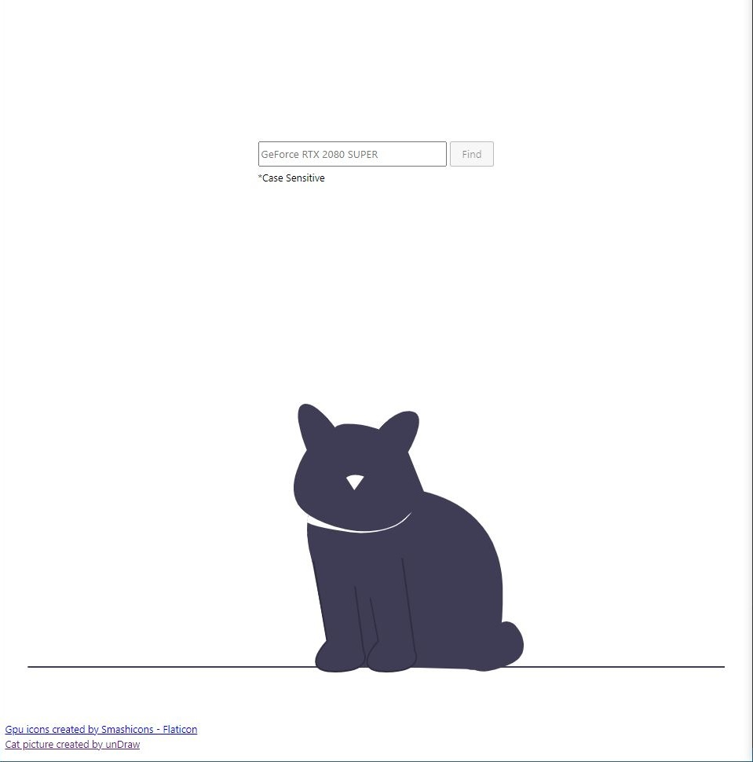

A small node application to find the latest Nvidia GPU drivers for a specified GPU and OS. 
It is based on: 

- [ZenitH-AT/nvidia-update](https://github.com/ZenitH-AT/nvidia-update)
- [ZenitH-AT/nvidia-data](https://github.com/ZenitH-AT/nvidia-data)

Table of Contents:

- [Details](#details)
- [Examples](#examples)
  - [Get Latest Drivers](#get-latest-drivers)
  - [Compare Current To Latest](#compare-current-to-latest)
- [Run Locally](#run-locally)

<br>



# Details

Available functions :

```js

import { get_driver_link, get_driver_details, get_gpus, get_os, parse_os } from "../libs/nvidia-utils.mjs";

get_gpus() // retrieve a list of GPU IDs
get_os() // retrieve a list of OS IDs


// retrieve a driver ID and the download URL
get_driver_link(
    {
        pfid : "782", // platform ID, 782 - GeForce GTX 950 (defult)
        osid : "57", // os ID, 57 - Windows 10 (defult)
        exception :  "No certified downloads were found for this configuration.", // Message displaied on Nvidia portal if search failed. Returns false if true (defult)
    }
); 
// Output:
// { 
//     url: 'driverResults.aspx/194380/en-us', 
//     id: '194380' 
// }


// retrieve a driver version and the reliese date
get_driver_details(
    id // driver ID to fetch details e.g. '194380'
); 
// Output:
// { 
//     version: '526.98', 
//     release_date: '2022.11.16' 
// }


// parse OS details to a JS Object:
parse_os(); 
// Windows 10 Enterprise 64-bit (10.0, Build 18363) (18362.19h1_release.190318-1202)
// 
// to this
// 
// {
//     os_name: 'Windows 10',
//     os_full: 'Windows 10 Enterprise 64-bit',
//     os_bit: '64-bit',
//     os_version: 'Enterprise',
//     buildID: '10.0.18363',
//     release: '18362.19h1_release.190318-1202'
// }

```

The repository also includes a script to create a `device-ids.mjs` file, listing all available GPU and OS options.

```bash

$ node run get-device-list

# The script is located at libs/generate-device-lists.js
# A new file will be created in the same folder

# libs/device-ids.mjs
# 
# const lists = {
#    gpu : { desktop : [], notebook : [] },
#    os : []
# }
# 
# export default lists

# import Lists from './libs/device-ids.mjs'
# 
# const {
#     gpu : pfids,
#     os : osids
# } = Lists;


```

# Examples

Examples below use information from a [DxDiag file](https://support.microsoft.com/en-us/windows/open-and-run-dxdiag-exe-dad7792c-2ad5-f6cd-5a37-bf92228dfd85) as input. It can be, however, replaced with a simple dropdown/s on the front-end.

```
------------------
System Information
------------------
         Operating System: Windows 10 Enterprise 64-bit (10.0, Build 18363) (18362.19h1_release.190318-1202)
---------------
Display Devices
---------------
           Card name: NVIDIA GeForce RTX 2080 SUPER
 Driver File Version: 26.21.0014.4166 (English)
    Driver Date/Size: 06.12.2019 0:00:00, 961960 bytes

```

## Get Latest Drivers

```js

import { get_driver_link, get_driver_details } from "../libs/nvidia-utils.mjs";
import { parse_os } from "../libs/file-utils.mjs";

const main = async () => {

    // query gpu and os list from GitHub
    const pfids = await get_gpus()
    const osids = await get_os()

    const gpu = "NVIDIA GeForce RTX 2080 SUPER".replace("NVIDIA", "").trim() // GPU names don't include the word NVIDIA
    const os_version = "Windows 10 Enterprise 64-bit (10.0, Build 18363) (18362.19h1_release.190318-1202)"
    const os_details = parse_os(os_version)
    const osid = osids.find(e => e.name == `${os_details.os_name} ${os_details.os_bit}`).id

    // Look for pfid, if not found - default to GTX 980

    const pfid = Object.keys(pfids.desktop).includes(gpu) ? pfids.desktop[gpu] :
    Object.keys(pfids.notebook).includes(gpu) ? pfids.notebook[gpu] : "755"

    const driver_url = await get_driver_link({pfid, osid});
    const driver_details = await get_driver_details(driver_url.id); // Beware CORS!

    console.log({
        osid,
        os : os_details.os_full,
        gpu,
        ...driver_details,
        driver_url,
    })

    // {
    //   osid: '57',
    //   os: 'Windows 10 Enterprise 64-bit',
    //   gpu: 'GeForce RTX 2080 SUPER',
    //   version: '526.98',
    //   release_date: '2022.11.16',
    //   driver_url: { url: 'driverResults.aspx/194380/en-us', id: '194380' }
    // }

}

main()

```

## Compare Current To Latest

```js

import { get_driver_link, get_driver_details } from "../libs/nvidia-utils.mjs";
import { parse_os } from "../libs/file-utils.mjs";

const main = async () => {

    // query gpu and os list from GitHub
    const pfids = await get_gpus()
    const osids = await get_os()

    const gpu = "NVIDIA GeForce RTX 2080 SUPER".replace("NVIDIA", "").trim(); // GPU names don't include the word NVIDIA
    const os_version = "Windows 10 Enterprise 64-bit (10.0, Build 18363) (18362.19h1_release.190318-1202)";
    const os_details = parse_os(os_version);
    const osid = osids.find(e => e.name == `${os_details.os_name} ${os_details.os_bit}`).id;

    // 26.21.0014.4166 => 44166 (can also be interpreted as 441.66)
    const installed_driver_version = "26.21.0014.4166 (English)".trim().match(/[\d.]+/)[0].slice(-6).replace(".","");

    // 06.12.2019 => 12.06.2019 (dd/mm/yyyy to mm/dd/yyyyy)
    let installed_driver_date = "06.12.2019 0:00:00, 961960 bytes".trim().match(/\d{2}(\.|\/)\d{2}(\.|\/)\d{4}/g)[0].split(/[./]/);
    installed_driver_date = `${installed_driver_date[1]}.${installed_driver_date[0]}.${installed_driver_date[2]}`

    // Look for pfid, if not found - default to GTX 980
    const pfid = Object.keys(pfids.desktop).includes(gpu) ? pfids.desktop[gpu] :
    Object.keys(pfids.notebook).includes(gpu) ? pfids.notebook[gpu] : "755";

    const driver_url = await get_driver_link({pfid, osid});
    const driver_details = await get_driver_details(driver_url.id); // Beware CORS!

    // Evaluate if new driver version is a higher number than the installed driver (44166 >= 52698)
    const is_up_to_date = Number(installed_driver_version) >= Number(driver_details.version.replace(".",""));

    // Calculate the number of days passed between new driver release date and installed driver date
    const days_difference = Math.floor( ( Date.parse(driver_details.release_date) - Date.parse(installed_driver_date) ) / 86400000 );

    console.log({
        osid,
        os : os_details.os_full,
        gpu,
        ...driver_details,
        comparison : {
            installed_driver_version : installed_driver_version.slice(0,3) + "." + installed_driver_version.slice(3),
            installed_driver_date : installed_driver_date,
            days_difference : `${days_difference} Days Old`,
            is_up_to_date
        },
        driver_url,
    });

    // {
    //     osid: '57',
    //     os: 'Windows 10 Enterprise 64-bit',
    //     gpu: 'GeForce RTX 2080 SUPER',
    //     version: '526.98',
    //     release_date: '2022.11.16',
    //     comparison: {
    //         installed_driver_version: '441.66',
    //         installed_driver_date: '06.12.2019',
    //         days_difference: '1253 Days Old',
    //         is_up_to_date: false
    //     },
    //     driver_url: { url: 'driverResults.aspx/194380/en-us', id: '194380' }
    // }

}

main()

```

# Run Locally

```bash

# Install dependancies
$ npm install

# Generate device lists file
$ npm run get-device-list

# Run a slow preview
$ npm run preview

# Slow preview goes through a list of GPUs, finds drivers for every available platform and then creates a .JSON file for each device in files/ folder

# const test_list = [
#     "GeForce 7025",
#     "Quadro FX 1500",
#     "GeForce4 Ti 4600",
#     "GeForce GTX 470",
#     "GeForce GTX 980",
#     "GeForce RTX 2070",
#     "GeForce 9600M GS",
#     "GeForce GTX 280M",
#     "GeForce 310M",
#     "GeForce GT 750M"
# ]

# Run a quick preview with predefined parameters 
$ npm run preview:fast 

# {
#   osid: '57',
#   os: 'Windows 10 Enterprise 64-bit',
#   gpu: 'GeForce RTX 2080 SUPER',
#   version: '526.98',
#   release_date: '2022.11.16',
#   driver_url: { url: 'driverResults.aspx/194380/en-us', id: '194380' }
# }

# Run a web preview 
$ npm run preview:web 

# Starts a Svelte app on http://localhost:5000/


```